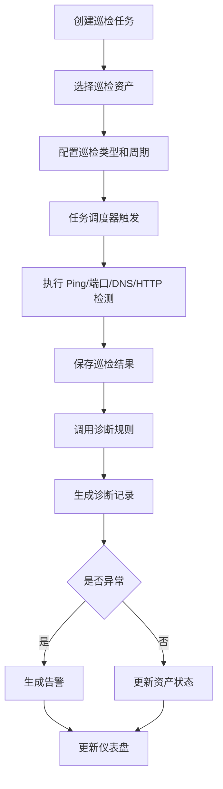
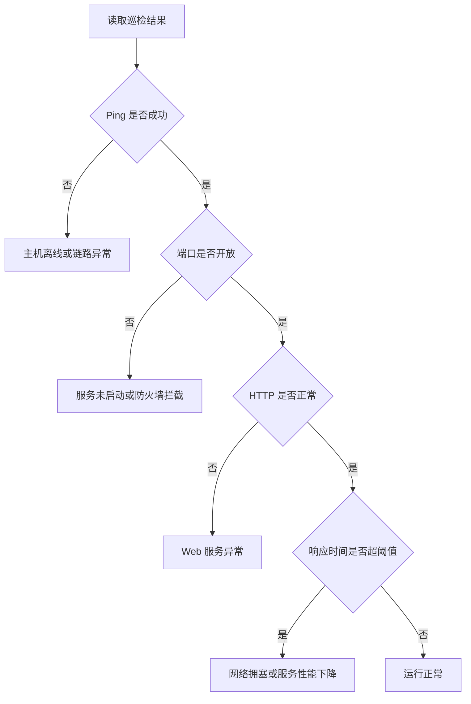

# 面向中小型网络的自动化巡检与故障诊断平台设计与实现

## 1. 选题定位

本课题面向中小型企业、实验室、机房或校园局域网等常见网络环境，设计并实现一个轻量级自动化运维平台。系统通过 Python 自动执行网络巡检任务，对主机连通性、服务端口、DNS 解析、HTTP 服务、响应时间等指标进行检测，并根据检测结果进行规则化故障诊断，最终通过可视化看板和巡检报告展示网络运行状态。

本课题不依赖 eNSP，重点体现网络工程专业能力、Python 自动化能力和运维平台工程实现能力。

## 2. 题目最终版本

推荐正式题名：

> 面向中小型网络的自动化巡检与故障诊断平台设计与实现

备选题名：

- 基于 Python 的中小型网络自动化巡检与故障诊断平台设计与实现
- 面向中小型网络的智能化巡检、故障定位与可视化平台设计与实现
- 面向校园局域网的自动化巡检与故障诊断系统设计与实现

建议使用第一个题名，表述稳妥，工程边界清楚，论文展开空间充足。

## 3. 建设目标

### 3.1 总体目标

设计并实现一个面向中小型网络的自动化巡检与故障诊断平台，实现网络资产统一管理、巡检任务配置、自动检测执行、故障诊断分析、可视化监控展示、异常告警通知和巡检报告生成等功能。

### 3.2 具体目标

- 建立网络资产台账，统一管理主机、服务器、网络设备和业务服务。
- 支持手动巡检和定时巡检，减少人工重复操作。
- 支持 Ping、TCP 端口、DNS、HTTP、响应时间等多维度检测。
- 根据检测结果自动判断常见故障类型。
- 通过仪表盘展示在线率、异常数、故障类型分布和历史趋势。
- 支持巡检结果留痕和 Excel/PDF 报告导出。
- 预留 SNMP、Prometheus、Docker/Kubernetes 等扩展能力。

## 4. 技术路线

### 4.1 后端技术

- Python 3.10+
- FastAPI：提供 REST API。
- SQLAlchemy：数据库 ORM。
- SQLite：开发和演示阶段使用。
- MySQL：论文中可作为可替换部署方案。
- APScheduler：定时巡检任务。
- requests：HTTP 服务检测。
- socket：TCP 端口检测。
- dnspython：DNS 解析检测。
- icmplib 或 subprocess：Ping 检测。
- openpyxl：Excel 巡检报告生成。
- loguru 或 logging：系统日志记录。

### 4.2 前端技术

- Vue 3 或 Bootstrap。
- Element Plus 或 Bootstrap Table。
- ECharts：统计图表和趋势图。
- Axios：调用后端接口。

### 4.3 演示环境

- Windows 本机开发。
- Linux 虚拟机作为部署演示环境。
- Docker 可选，用于模拟 Nginx、MySQL、Redis 等服务。
- K8s 不作为核心依赖，只作为扩展展望或加分实验。

## GitHub 类似项目参考与优化结论

### 参考项目

| 项目 | 主要特点 | 对本课题的借鉴 |
|---|---|---|
| [NetAlertX](https://github.com/netalertx/NetAlertX) | 网络可见性、持续资产发现、设备变更检测、IPAM 漂移识别、通知网关、插件体系、本地数据存储 | 借鉴“资产变化感知”和“告警闭环”，增加资产状态变更记录、告警确认、恢复记录和通知限流 |
| [Atlas](https://github.com/karam-ajaj/atlas) | 扫描本地主机、邻近子网和 Docker 容器，使用 FastAPI 后端和 React 前端展示动态网络图 | 借鉴“拓扑可视化”和“容器服务发现”，但本科阶段只做逻辑拓扑和容器暴露端口检测 |
| [LibreNMS](https://github.com/librenms/librenms) | 基于 SNMP 的自动发现网络监控系统，支持多种网络硬件和操作系统 | 借鉴 SNMP 作为高级扩展，不把 SNMP 作为主线，避免硬件环境和协议细节拖慢进度 |
| [GingerScan](https://github.com/mrxcherif/gingerscan) | 支持异步扫描、端口扫描、服务识别、报告导出、Web Dashboard、扫描取消、速率控制 | 借鉴扫描队列、任务取消、速率限制、多格式报告等工程设计 |
| [network-diagnostic-toolkit](https://github.com/sandrineuwineza/network-diagnostic-toolkit) | 包含 ping sweep、DNS 验证、端口扫描、HTTP/TLS 健康检查、traceroute 和 Web Dashboard | 借鉴“诊断工具链”的范围，作为本科实现的核心功能边界 |

### 优化后的项目定位

参考开源项目后，本课题不建议做成大型 NMS，也不建议做成纯扫描器。更稳妥的定位是：

> 面向中小型网络的轻量级运维巡检平台，核心能力是资产台账、自动巡检、变更感知、故障诊断、告警闭环、可视化展示和报告留痕。

优化重点：

- 从“检测工具”升级为“巡检平台”：增加任务、结果、告警、报告和历史趋势。
- 从“静态资产表”升级为“资产状态管理”：记录在线、离线、端口变化、首次发现、最后发现时间。
- 从“单次扫描”升级为“任务调度”：支持手动执行、定时执行、任务取消和执行日志。
- 从“异常列表”升级为“告警闭环”：支持告警触发、确认、恢复和历史追踪。
- 从“普通图表”升级为“运维看板”：突出在线率、异常趋势、故障分布、Top 异常资产。
- 从“功能堆叠”转向“本科可交付”：SNMP、Prometheus、K8s 作为扩展，不进入主线风险路径。

### 借鉴后的新增设计点

#### 1. 资产变更感知

参考 NetAlertX 的资产发现和变更监测思路，系统增加资产变更记录：

- 新资产发现。
- 资产离线。
- 资产恢复在线。
- IP 地址变化。
- MAC 地址变化，可选。
- 开放端口变化。
- 服务状态变化。

新增表建议：`asset_change_log`。

| 字段 | 类型 | 说明 |
|---|---|---|
| id | int | 主键 |
| asset_id | int | 资产 ID |
| change_type | varchar | 变更类型 |
| old_value | text | 旧值 |
| new_value | text | 新值 |
| detected_at | datetime | 发现时间 |

论文写法：

> 系统不仅保存巡检结果，还对资产状态变化进行记录，使管理员能够追踪设备上线、离线和服务端口变化情况。

#### 2. 扫描队列与任务状态

参考 GingerScan 的扫描任务管理思路，巡检任务不只保存“成功或失败”，而是增加完整状态：

- 待执行。
- 执行中。
- 已完成。
- 执行失败。
- 已取消。

任务控制功能：

- 立即执行。
- 暂停任务。
- 取消执行。
- 重试失败任务。
- 查看执行日志。

本科实现建议：

- 不需要做复杂分布式队列。
- 用数据库字段记录状态。
- 后端用 APScheduler + 线程池即可。

#### 3. 检测器插件化设计

参考 NetAlertX 的插件思路，但实现要轻量。可以把每种检测封装成独立检测器：

```text
BaseChecker
├── PingChecker
├── PortChecker
├── DnsChecker
├── HttpChecker
├── TlsChecker
└── TracerouteChecker
```

好处：

- 论文中可以体现模块化设计。
- 后期增加 SNMP、Docker、Prometheus 不需要改核心流程。
- 答辩时容易讲清楚系统扩展性。

#### 4. HTTP/TLS 服务健康检查

参考 network-diagnostic-toolkit 的 HTTP/TLS 检查能力，建议把 HTTP 检测升级为服务健康检查：

- HTTP 状态码。
- 响应时间。
- 页面关键字匹配，可选。
- TLS 证书过期时间，可选。
- 重定向检测，可选。

本科建议：

- 必做 HTTP 状态码和响应时间。
- TLS 证书检测作为加分功能。

#### 5. 告警限流与恢复机制

参考 NetAlertX 的通知场景，避免同一资产持续异常时反复刷告警。

告警策略：

- 连续 3 次失败才触发告警。
- 已触发告警未恢复前不重复生成新告警。
- 连续 2 次正常后标记恢复。
- 支持手动确认告警。

论文价值：

- 体现实际运维中的“告警降噪”思想。
- 比单纯异常提示更专业。

#### 6. 本地优先与数据安全

参考 NetAlertX 的本地数据存储思路，本课题可以强调：

- 巡检数据默认保存在本地数据库。
- 不上传外部云平台。
- 支持数据库备份。
- 登录密码加密存储。
- 操作日志可追踪。

这个点适合写在非功能需求和安全性设计中。

#### 7. 授权扫描边界

参考扫描工具类项目的安全提示，本系统应明确：

- 只允许扫描用户授权管理的网络范围。
- 扫描网段需要管理员配置。
- 限制扫描速率，避免影响业务网络。
- 保留扫描日志，便于审计。

这个点适合写进系统设计和答辩说明，能避免老师质疑“扫描是否合法”。

## 5. 系统角色

### 5.1 管理员

- 管理网络资产。
- 配置巡检任务。
- 查看故障诊断结果。
- 维护诊断规则。
- 导出巡检报告。

### 5.2 普通查看用户，可选

- 查看仪表盘。
- 查看巡检结果。
- 下载报告。

本科毕设阶段可以只实现管理员角色，权限模块做轻量化处理。

## 6. 功能模块设计

### 6.1 用户登录与权限管理模块

功能说明：

- 管理员登录。
- 登录状态保持。
- 简单角色控制。
- 修改密码。

建议实现程度：

- 必做：管理员登录、退出。
- 可选：角色权限、操作权限控制。

论文价值：

- 体现系统完整性。
- 支撑后续操作审计模块。

### 6.2 网络资产管理模块

功能说明：

- 新增资产。
- 编辑资产。
- 删除资产。
- 查询资产。
- 按类型、区域、状态筛选资产。
- 批量导入资产。
- 批量导出资产。

资产字段建议：

- 资产名称。
- IP 地址。
- 主机名。
- 资产类型。
- 所属区域。
- 操作系统。
- 业务名称。
- 检测端口。
- 负责人。
- 备注。
- 当前状态。

资产类型建议：

- 服务器。
- 网络设备。
- Web 服务。
- 数据库服务。
- 中间件服务。
- 普通终端。
- 容器服务，可选。

高分点：

- 不只是做 IP 列表，而是做资产台账。
- 后续巡检、诊断、报告都围绕资产展开，系统逻辑完整。

### 6.3 资产发现模块

功能说明：

- 输入 IP 网段。
- 扫描网段内在线主机。
- 自动生成待确认资产列表。
- 支持将扫描结果加入资产库。
- 记录首次发现时间和最后发现时间。
- 对比历史扫描结果，发现新增资产和离线资产。

实现方式：

- 使用 Ping 扫描网段。
- 可选调用 Nmap。
- 对常见端口进行快速探测，例如 22、80、443、3306、6379、8080。
- 控制扫描速率，避免对网络造成明显影响。

建议实现程度：

- 必做：单个 IP 或 IP 列表检测。
- 推荐：支持小网段扫描，例如 192.168.1.1/24。
- 可选：Nmap 集成。

论文价值：

- 体现自动化运维特色。
- 比单纯手工录入更有亮点。

### 6.4 巡检任务管理模块

功能说明：

- 创建巡检任务。
- 设置巡检对象。
- 设置巡检类型。
- 设置执行周期。
- 启用或停用任务。
- 手动立即执行。
- 取消正在执行的任务。
- 失败任务重试。
- 查看任务执行历史。
- 查看任务执行日志。

巡检类型：

- 连通性巡检。
- 端口巡检。
- DNS 巡检。
- HTTP 巡检。
- 综合巡检。
- 自定义巡检，可选。

任务周期：

- 手动执行。
- 每 5 分钟。
- 每 30 分钟。
- 每小时。
- 每天。

实现建议：

- APScheduler 负责定时任务。
- 数据库存储任务配置。
- 执行结果写入巡检结果表。
- 使用任务状态字段记录待执行、执行中、完成、失败、取消。
- 本科阶段用线程池即可，不必引入 Celery。

### 6.5 自动检测执行模块

功能说明：

- Ping 检测主机是否在线。
- TCP 端口检测服务是否开放。
- DNS 检测域名是否可解析。
- HTTP 检测 Web 服务是否可访问。
- TLS 证书检测，可选。
- 响应时间检测。
- Traceroute 检测链路路径，可选。

检测结果字段：

- 检测对象。
- 检测类型。
- 检测时间。
- 检测状态。
- 响应时间。
- 错误信息。
- 原始输出。

状态建议：

- 正常。
- 警告。
- 异常。
- 未知。

高分点：

- 多维度检测比单一 Ping 更像真正的运维平台。
- 检测结果能支撑后续诊断规则。
- 检测器独立封装，便于论文中体现模块化和可扩展性。

### 6.6 故障诊断规则模块

功能说明：

- 根据巡检结果自动判断故障类型。
- 输出故障等级。
- 输出处理建议。
- 支持规则管理，可选。
- 支持连续失败次数判断，减少偶发网络抖动导致的误报。

基础诊断规则：

| 检测现象 | 故障类型 | 故障等级 | 处理建议 |
|---|---|---|---|
| Ping 失败 | 主机离线或链路异常 | 严重 | 检查主机电源、网线、交换机端口、网关配置 |
| Ping 正常但端口失败 | 服务未启动或防火墙拦截 | 重要 | 检查服务进程、防火墙策略和监听端口 |
| DNS 解析失败 | DNS 配置或解析服务异常 | 重要 | 检查 DNS 地址、解析记录和 DNS 服务状态 |
| HTTP 状态码 4xx | 请求路径或访问权限异常 | 一般 | 检查 URL、权限配置和路由规则 |
| HTTP 状态码 5xx | Web 应用内部错误 | 重要 | 检查应用日志、数据库连接和服务负载 |
| 响应时间超过阈值 | 网络拥塞或服务性能下降 | 警告 | 检查链路质量、服务器资源和业务负载 |
| 连续多次异常 | 持续性故障 | 严重 | 立即通知管理员并生成故障记录 |
| TLS 证书即将过期 | 证书有效期风险 | 警告 | 检查证书有效期并及时续签 |

论文包装：

> 系统设计了基于多维检测结果的规则化故障诊断方法，通过对连通性、端口状态、DNS 解析结果和 HTTP 响应状态进行综合判断，实现常见网络故障的自动分类与处理建议生成。

### 6.7 告警通知模块

功能说明：

- 当检测结果异常时生成告警。
- 告警分级。
- 告警确认。
- 告警恢复。
- 告警历史查询。
- 告警限流。
- 告警恢复判定。

告警等级：

- 一般。
- 警告。
- 重要。
- 严重。

通知方式：

- 系统内通知，必做。
- 邮件通知，可选。
- 企业微信/钉钉机器人通知，可选。

建议实现程度：

- 必做：异常记录自动进入告警列表。
- 推荐：支持告警确认和恢复状态。
- 推荐：同一资产同一故障未恢复前不重复生成告警。
- 可选：邮件或机器人通知。

高分点：

- 运维平台不只是发现异常，还能形成告警闭环。
- 告警限流能体现实际运维场景中的告警降噪。

### 6.8 可视化监控看板模块

功能说明：

- 展示总资产数。
- 展示在线资产数。
- 展示异常资产数。
- 展示今日巡检次数。
- 展示资产在线率。
- 展示故障类型分布。
- 展示最近异常记录。
- 展示巡检趋势图。
- 展示资产变更事件。
- 展示待处理告警数量。

图表建议：

- 在线率折线图。
- 异常类型饼图。
- 资产状态柱状图。
- 最近 7 天巡检趋势图。
- Top 异常资产排行。
- 最近资产变更时间线。

高分点：

- 答辩时可视化最直观。
- 老师容易感知系统完成度。

### 6.9 网络拓扑展示模块

功能说明：

- 展示资产之间的逻辑关系。
- 用节点颜色表示资产状态。
- 点击节点查看资产详情。
- 展示核心交换机、服务器、业务服务之间的关系。

实现方式：

- 简单方式：手工维护资产关系。
- 前端使用 ECharts Graph。
- 节点颜色区分正常、警告、异常。

建议实现程度：

- 可选但推荐。
- 不需要做复杂自动拓扑发现。
- 做一个逻辑拓扑图即可。

论文价值：

- 让系统更贴近网络工程专业。
- 区分于普通后台管理系统。

### 6.10 巡检报告模块

功能说明：

- 按日期生成报告。
- 按任务生成报告。
- 导出 Excel 报告。
- 可选导出 PDF 报告。
- 报告中包含巡检概况、异常资产、故障分类、处理建议。

报告内容：

- 报告标题。
- 巡检时间。
- 巡检任务名称。
- 巡检资产数量。
- 正常数量。
- 异常数量。
- 异常明细。
- 故障诊断建议。
- 统计图表，可选。

高分点：

- 报告导出是答辩展示的强结果。
- 论文测试章节容易截图说明。

### 6.11 日志与审计模块

功能说明：

- 记录用户登录日志。
- 记录资产变更日志。
- 记录任务执行日志。
- 记录报告生成日志。
- 支持按时间和操作类型查询。

建议实现程度：

- 必做：任务执行日志。
- 推荐：用户操作日志。

论文价值：

- 体现系统可靠性和可维护性。

### 6.12 阈值与基线策略模块

功能说明：

- 设置响应时间阈值。
- 设置端口异常判定规则。
- 设置连续失败次数。
- 设置告警触发条件。
- 设置恢复判定条件。

示例：

- Ping 响应时间超过 100ms 判定为警告。
- HTTP 响应时间超过 2s 判定为警告。
- 连续 3 次 Ping 失败判定为严重故障。
- 端口连续 2 次失败触发告警。

高分点：

- 从“检测工具”提升为“运维平台”。
- 规则和阈值使系统具有可配置性。

### 6.13 数据统计与历史分析模块

功能说明：

- 查看资产历史状态。
- 查看某个资产的巡检趋势。
- 统计故障次数。
- 统计平均响应时间。
- 统计故障恢复时间，可选。

指标建议：

- 在线率。
- 故障次数。
- 平均响应时间。
- 平均恢复时间。
- 高频异常资产。

论文价值：

- 支撑系统测试和结果分析章节。

### 6.14 容器服务检测扩展模块，可选

功能说明：

- 检测 Docker 容器状态。
- 检测容器暴露端口。
- 检测容器内服务可访问性。

实现方式：

- 本科阶段可不直接调用 Docker API。
- 可以将容器暴露出来的 HTTP 服务、MySQL 服务、Redis 服务作为普通服务检测。
- 如果时间充足，可读取 Docker 容器名称、IP、端口映射并加入资产候选列表。

论文写法：

> 系统可扩展至容器化服务巡检场景，通过对容器暴露端口和 Web 服务状态进行检测，实现对轻量级容器业务的基础运维监测。

### 6.15 Kubernetes 扩展模块，可选展望

功能说明：

- 检测 K8s 集群中的 Service 可访问性。
- 检测 Pod 暴露服务。
- 结合 Prometheus 获取监控指标。

建议：

- 不作为主线开发。
- 放在系统扩展或总结展望中。
- 如果后期时间充足，可以做一个简单演示。

论文价值：

- 提升技术前沿感。
- 不增加核心实现风险。

## 7. 功能优先级

### 7.1 必做功能

- 用户登录。
- 网络资产管理。
- 巡检任务管理。
- Ping 检测。
- TCP 端口检测。
- HTTP 检测。
- 巡检结果保存。
- 故障诊断规则。
- 仪表盘统计。
- 巡检报告导出。
- 任务执行日志。

### 7.2 推荐功能

- DNS 检测。
- 告警通知。
- 阈值策略配置。
- 资产批量导入。
- 资产变更记录。
- 历史趋势分析。
- 操作日志。
- 网络逻辑拓扑图。
- 任务取消和失败重试。

### 7.3 可选加分功能

- Nmap 集成。
- SNMP 基础采集。
- 邮件或企业微信通知。
- PDF 报告导出。
- Docker 服务巡检。
- TLS 证书有效期检测。
- Prometheus 指标导出。
- K8s 扩展实验。

## 8. 数据库设计

### 8.1 用户表 user

| 字段 | 类型 | 说明 |
|---|---|---|
| id | int | 主键 |
| username | varchar | 用户名 |
| password_hash | varchar | 密码哈希 |
| role | varchar | 角色 |
| created_at | datetime | 创建时间 |
| last_login_at | datetime | 最后登录时间 |

### 8.2 资产表 asset

| 字段 | 类型 | 说明 |
|---|---|---|
| id | int | 主键 |
| name | varchar | 资产名称 |
| ip | varchar | IP 地址 |
| hostname | varchar | 主机名 |
| asset_type | varchar | 资产类型 |
| location | varchar | 所属区域 |
| os_type | varchar | 操作系统 |
| business_name | varchar | 业务名称 |
| ports | varchar | 检测端口 |
| owner | varchar | 负责人 |
| status | varchar | 当前状态 |
| remark | text | 备注 |
| created_at | datetime | 创建时间 |
| updated_at | datetime | 更新时间 |

### 8.3 巡检任务表 inspection_task

| 字段 | 类型 | 说明 |
|---|---|---|
| id | int | 主键 |
| task_name | varchar | 任务名称 |
| task_type | varchar | 任务类型 |
| target_scope | text | 巡检范围 |
| cycle_type | varchar | 周期类型 |
| cycle_value | int | 周期值 |
| enabled | bool | 是否启用 |
| created_at | datetime | 创建时间 |
| updated_at | datetime | 更新时间 |

### 8.4 巡检结果表 inspection_result

| 字段 | 类型 | 说明 |
|---|---|---|
| id | int | 主键 |
| task_id | int | 巡检任务 ID |
| asset_id | int | 资产 ID |
| check_type | varchar | 检测类型 |
| status | varchar | 检测状态 |
| response_time | float | 响应时间 |
| error_message | text | 错误信息 |
| raw_output | text | 原始输出 |
| checked_at | datetime | 检测时间 |

### 8.5 故障诊断表 diagnosis_record

| 字段 | 类型 | 说明 |
|---|---|---|
| id | int | 主键 |
| result_id | int | 巡检结果 ID |
| asset_id | int | 资产 ID |
| fault_type | varchar | 故障类型 |
| fault_level | varchar | 故障等级 |
| suggestion | text | 处理建议 |
| created_at | datetime | 创建时间 |

### 8.6 告警表 alert

| 字段 | 类型 | 说明 |
|---|---|---|
| id | int | 主键 |
| asset_id | int | 资产 ID |
| diagnosis_id | int | 诊断记录 ID |
| alert_title | varchar | 告警标题 |
| alert_level | varchar | 告警等级 |
| alert_status | varchar | 告警状态 |
| first_triggered_at | datetime | 首次触发时间 |
| recovered_at | datetime | 恢复时间 |
| confirmed_by | varchar | 确认人 |

### 8.7 报告表 report

| 字段 | 类型 | 说明 |
|---|---|---|
| id | int | 主键 |
| report_name | varchar | 报告名称 |
| report_type | varchar | 报告类型 |
| report_date | date | 报告日期 |
| file_path | varchar | 文件路径 |
| created_at | datetime | 创建时间 |

### 8.8 操作日志表 operation_log

| 字段 | 类型 | 说明 |
|---|---|---|
| id | int | 主键 |
| username | varchar | 操作用户 |
| action | varchar | 操作类型 |
| target | varchar | 操作对象 |
| detail | text | 操作详情 |
| created_at | datetime | 创建时间 |

### 8.9 资产变更表 asset_change_log

| 字段 | 类型 | 说明 |
|---|---|---|
| id | int | 主键 |
| asset_id | int | 资产 ID |
| change_type | varchar | 变更类型 |
| old_value | text | 旧值 |
| new_value | text | 新值 |
| detected_at | datetime | 发现时间 |

### 8.10 任务执行日志表 task_run_log

| 字段 | 类型 | 说明 |
|---|---|---|
| id | int | 主键 |
| task_id | int | 巡检任务 ID |
| run_status | varchar | 执行状态 |
| started_at | datetime | 开始时间 |
| finished_at | datetime | 结束时间 |
| total_count | int | 巡检总数 |
| success_count | int | 正常数量 |
| failed_count | int | 异常数量 |
| message | text | 执行信息 |

## 9. 页面设计

### 9.1 登录页

- 用户名输入。
- 密码输入。
- 登录按钮。

### 9.2 首页仪表盘

- 总资产数。
- 在线资产数。
- 异常资产数。
- 今日巡检次数。
- 在线率趋势图。
- 故障类型分布图。
- 最近告警列表。

### 9.3 资产管理页

- 资产列表。
- 新增资产。
- 编辑资产。
- 删除资产。
- 批量导入。
- 状态筛选。

### 9.4 资产发现页

- 输入扫描网段。
- 执行扫描。
- 展示发现结果。
- 加入资产库。

### 9.5 巡检任务页

- 任务列表。
- 新建任务。
- 编辑任务。
- 启停任务。
- 立即执行。
- 查看执行记录。

### 9.6 巡检结果页

- 结果列表。
- 按资产筛选。
- 按检测类型筛选。
- 按状态筛选。
- 查看错误详情。

### 9.7 故障诊断页

- 故障记录列表。
- 故障类型。
- 故障等级。
- 处理建议。
- 关联巡检结果。

### 9.8 告警中心页

- 当前告警。
- 历史告警。
- 告警确认。
- 告警恢复。
- 告警等级筛选。

### 9.9 拓扑展示页

- 逻辑拓扑图。
- 节点状态颜色。
- 点击节点查看详情。
- 异常节点突出显示。

### 9.10 报告管理页

- 生成报告。
- 报告列表。
- 下载报告。
- 删除报告。

### 9.11 系统设置页

- 阈值设置。
- 告警策略设置。
- 检测超时时间设置。
- 系统参数设置。

## 10. 核心流程

### 10.1 巡检执行流程



### 10.2 故障诊断流程



## 11. 接口设计示例

### 11.1 资产接口

- `GET /api/assets`：获取资产列表。
- `POST /api/assets`：新增资产。
- `PUT /api/assets/{id}`：更新资产。
- `DELETE /api/assets/{id}`：删除资产。
- `POST /api/assets/import`：批量导入资产。

### 11.2 巡检任务接口

- `GET /api/tasks`：获取任务列表。
- `POST /api/tasks`：创建任务。
- `PUT /api/tasks/{id}`：更新任务。
- `POST /api/tasks/{id}/run`：立即执行任务。
- `POST /api/tasks/{id}/enable`：启用任务。
- `POST /api/tasks/{id}/disable`：停用任务。

### 11.3 巡检结果接口

- `GET /api/results`：获取巡检结果。
- `GET /api/results/{id}`：查看结果详情。

### 11.4 诊断与告警接口

- `GET /api/diagnosis`：获取诊断记录。
- `GET /api/alerts`：获取告警列表。
- `POST /api/alerts/{id}/confirm`：确认告警。
- `POST /api/alerts/{id}/recover`：恢复告警。

### 11.5 仪表盘接口

- `GET /api/dashboard/summary`：获取概览数据。
- `GET /api/dashboard/trend`：获取趋势数据。
- `GET /api/dashboard/fault-types`：获取故障类型分布。

### 11.6 报告接口

- `POST /api/reports/generate`：生成报告。
- `GET /api/reports`：获取报告列表。
- `GET /api/reports/{id}/download`：下载报告。

## 12. 开发里程碑

### 第 1 阶段：选题与开题

时间：第 1-2 周。

任务：

- 确认题目。
- 明确研究背景。
- 确定技术路线。
- 完成开题报告。

产出：

- 开题报告。
- 任务书。
- 技术路线图。

### 第 2 阶段：需求分析

时间：第 3 周。

任务：

- 分析系统用户。
- 梳理功能需求。
- 梳理非功能需求。
- 绘制业务流程。

产出：

- 需求分析章节。
- 功能模块图。
- 用例图。

### 第 3 阶段：系统设计

时间：第 4 周。

任务：

- 设计系统架构。
- 设计数据库。
- 设计接口。
- 设计巡检流程。
- 设计诊断规则。

产出：

- 系统架构图。
- 数据库 ER 图。
- 接口设计文档。
- 诊断规则表。

### 第 4 阶段：后端核心功能开发

时间：第 5-6 周。

任务：

- 搭建 FastAPI 项目。
- 实现用户登录。
- 实现资产管理。
- 实现巡检任务管理。
- 实现 Ping、端口、HTTP 检测。

产出：

- 后端 API。
- 数据库表结构。
- 核心巡检功能。

### 第 5 阶段：诊断、告警和报告开发

时间：第 7-8 周。

任务：

- 实现故障诊断规则。
- 实现告警中心。
- 实现阈值策略。
- 实现 Excel 报告导出。

产出：

- 诊断记录。
- 告警列表。
- 巡检报告。

### 第 6 阶段：前端页面开发

时间：第 9 周。

任务：

- 实现登录页。
- 实现仪表盘。
- 实现资产管理页。
- 实现巡检任务页。
- 实现结果和告警页面。
- 实现报告页面。

产出：

- 可演示前端系统。

### 第 7 阶段：联调与测试

时间：第 10 周。

任务：

- 前后端联调。
- 准备测试资产。
- 设计正常、离线、端口异常、HTTP 异常等场景。
- 修复问题。

产出：

- 测试用例。
- 测试截图。
- 可稳定演示版本。

### 第 8 阶段：论文撰写与答辩准备

时间：第 11-12 周。

任务：

- 完成论文初稿。
- 补充系统截图。
- 完成测试章节。
- 制作答辩 PPT。
- 准备演示脚本。

产出：

- 论文初稿。
- 查重前版本。
- 答辩 PPT。
- 系统演示视频，可选。

## 13. 论文目录建议

```text
第 1 章 绪论
1.1 研究背景
1.2 研究意义
1.3 国内外研究现状
1.4 主要研究内容
1.5 论文组织结构

第 2 章 相关技术介绍
2.1 Python 技术
2.2 FastAPI 框架
2.3 网络巡检相关技术
2.4 定时任务调度技术
2.5 数据库技术
2.6 前端可视化技术

第 3 章 系统需求分析
3.1 系统可行性分析
3.2 用户角色分析
3.3 功能需求分析
3.4 非功能需求分析
3.5 系统业务流程分析

第 4 章 系统总体设计
4.1 系统架构设计
4.2 功能模块设计
4.3 数据库设计
4.4 巡检流程设计
4.5 故障诊断规则设计

第 5 章 系统详细设计与实现
5.1 用户登录模块实现
5.2 网络资产管理模块实现
5.3 巡检任务管理模块实现
5.4 自动检测执行模块实现
5.5 故障诊断模块实现
5.6 告警通知模块实现
5.7 可视化看板模块实现
5.8 巡检报告模块实现

第 6 章 系统测试
6.1 测试环境
6.2 功能测试
6.3 异常场景测试
6.4 性能测试
6.5 测试结果分析

第 7 章 总结与展望
7.1 工作总结
7.2 不足之处
7.3 后续展望
```

## 14. 开题报告可用内容

### 14.1 研究背景

随着企业信息化程度不断提高，中小型网络环境中服务器、网络设备和业务系统数量逐渐增多。传统依靠人工方式进行网络巡检和故障排查的方法存在效率低、结果不统一、故障发现不及时等问题。自动化巡检与故障诊断平台能够将常见检测操作流程化、自动化和可视化，对提升网络运维效率具有实际意义。

### 14.2 研究意义

本课题通过 Python 技术实现网络资产管理、自动巡检、故障诊断、告警通知和报告生成等功能，有助于降低人工巡检成本，提高故障发现效率，并为中小型网络环境提供一种轻量级运维辅助方案。同时，该课题与网络工程专业课程中的计算机网络、网络安全、网络管理、Linux 运维和程序设计等知识密切相关，具有较好的工程实践价值。

### 14.3 主要研究内容

- 研究中小型网络环境中的常见巡检需求和故障类型。
- 设计网络资产管理和巡检任务调度模型。
- 实现基于 Ping、端口、DNS、HTTP 的多维度检测方法。
- 设计基于规则的故障诊断方法。
- 实现可视化看板、告警中心和巡检报告功能。
- 对系统进行功能测试和异常场景测试。

### 14.4 创新点

- 将多种基础网络检测能力整合到统一平台中。
- 设计基于多维检测结果的规则化故障诊断方法。
- 支持巡检任务自动调度和异常告警闭环。
- 通过可视化看板和自动报告提升巡检结果表达效果。
- 预留容器化服务和云原生场景扩展能力。

## 15. 答辩演示方案

### 15.1 演示资产准备

准备 5 类资产：

- 正常主机：Ping 正常，端口正常。
- 离线主机：Ping 失败。
- Web 服务异常主机：Ping 正常，HTTP 检测失败。
- 端口异常主机：Ping 正常，端口关闭。
- 响应慢服务：HTTP 可访问但响应时间超过阈值。

### 15.2 演示流程

1. 登录系统。
2. 展示首页仪表盘。
3. 展示网络资产管理。
4. 新建或执行巡检任务。
5. 查看巡检结果。
6. 查看故障诊断建议。
7. 查看告警中心。
8. 查看拓扑图或趋势图。
9. 生成并下载巡检报告。

### 15.3 答辩重点表达

- 本系统解决的是人工巡检效率低和结果难留痕的问题。
- 系统通过多维检测提高故障判断准确性。
- 规则化诊断方法简单可解释，适合中小型网络场景。
- 系统实现了从资产、巡检、诊断、告警到报告的闭环。

## 16. 测试计划

### 16.1 功能测试

| 测试项 | 测试内容 | 预期结果 |
|---|---|---|
| 用户登录 | 输入正确账号密码 | 登录成功 |
| 资产新增 | 输入合法资产信息 | 资产保存成功 |
| 资产查询 | 按 IP 或类型查询 | 返回匹配资产 |
| 任务创建 | 创建综合巡检任务 | 任务保存成功 |
| 手动巡检 | 点击立即执行 | 生成巡检结果 |
| Ping 检测 | 检测在线主机 | 返回正常状态 |
| 端口检测 | 检测开放端口 | 返回正常状态 |
| HTTP 检测 | 检测 Web 服务 | 返回状态码和响应时间 |
| 故障诊断 | 输入异常结果 | 生成诊断建议 |
| 报告导出 | 生成 Excel 报告 | 文件导出成功 |

### 16.2 异常测试

| 场景 | 输入或条件 | 预期结果 |
|---|---|---|
| 主机离线 | 不存在的 IP | 标记为主机离线 |
| 端口关闭 | 检测未开放端口 | 标记为端口异常 |
| DNS 错误 | 输入错误域名 | 标记为 DNS 异常 |
| HTTP 失败 | Web 服务关闭 | 标记为 HTTP 异常 |
| 响应超时 | 设置较短超时时间 | 标记为响应超时 |

### 16.3 性能测试

建议测试：

- 10 个资产巡检耗时。
- 50 个资产巡检耗时。
- 100 个资产巡检耗时。
- 报告生成耗时。
- 页面加载耗时。

本科阶段不需要追求高并发，测试重点是系统在中小规模资产下可正常运行。

## 17. 风险控制

### 17.1 技术风险

风险：

- Ping 在不同系统下命令差异较大。
- 扫描大量 IP 可能较慢。
- 前后端联调耗时。

控制措施：

- 优先封装统一检测函数。
- 控制演示资产规模。
- 先完成后端 API，再做前端页面。

### 17.2 范围风险

风险：

- 功能模块太多导致做不完。

控制措施：

- 先完成必做功能。
- 推荐功能按时间选择。
- K8s、SNMP、PDF 报告作为可选扩展。

### 17.3 答辩风险

风险：

- 现场网络环境不稳定。

控制措施：

- 准备本地 Docker 或虚拟机演示环境。
- 准备系统截图和演示视频。
- 准备固定测试数据。

## 18. 最小可交付版本

如果时间不足，最低完成以下内容即可支撑答辩：

- 登录。
- 资产管理。
- 巡检任务。
- Ping 检测。
- 端口检测。
- HTTP 检测。
- 巡检结果。
- 故障诊断。
- 首页仪表盘。
- Excel 报告导出。

这个版本已经能形成完整闭环。

## 19. 推荐高分版本

如果想冲更高分，建议在最小版本基础上增加：

- DNS 检测。
- 告警中心。
- 阈值策略。
- 历史趋势分析。
- 网络逻辑拓扑图。
- 资产批量导入。
- 操作日志。

这个版本既丰富，又不会明显失控。

## 20. 后续待办清单

- [ ] 确定正式题名。
- [ ] 写开题报告。
- [ ] 画系统架构图。
- [ ] 画数据库 ER 图。
- [ ] 搭建 FastAPI 后端项目。
- [ ] 设计数据库模型。
- [ ] 实现资产管理接口。
- [ ] 实现 Ping 检测。
- [ ] 实现端口检测。
- [ ] 实现 HTTP 检测。
- [ ] 实现巡检任务调度。
- [ ] 实现故障诊断规则。
- [ ] 实现告警中心。
- [ ] 实现仪表盘。
- [ ] 实现报告导出。
- [ ] 准备测试数据。
- [ ] 写论文初稿。
- [ ] 制作答辩 PPT。
